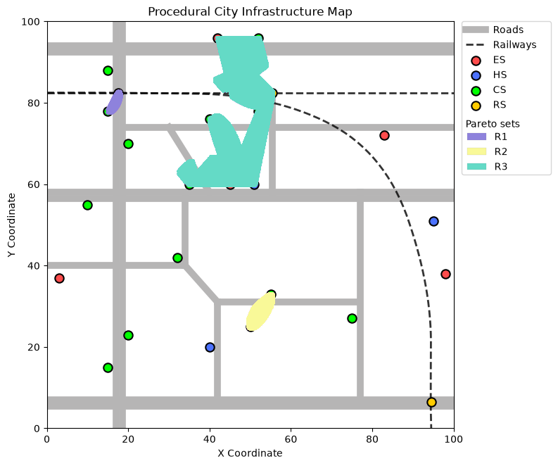
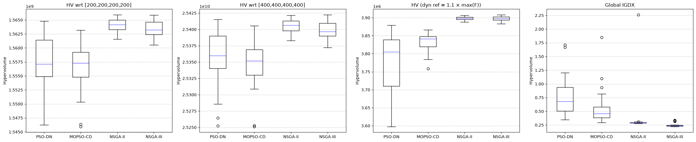
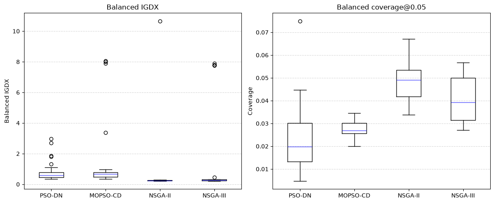
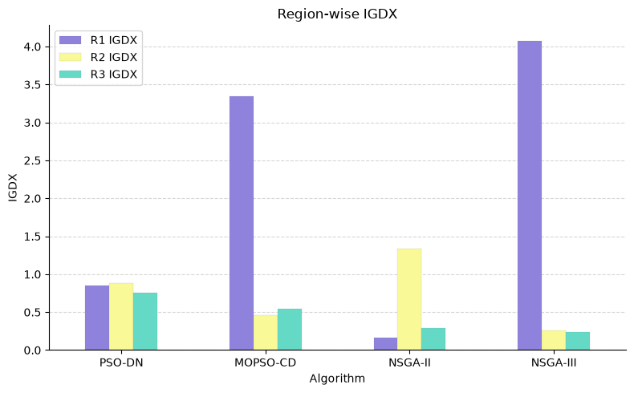
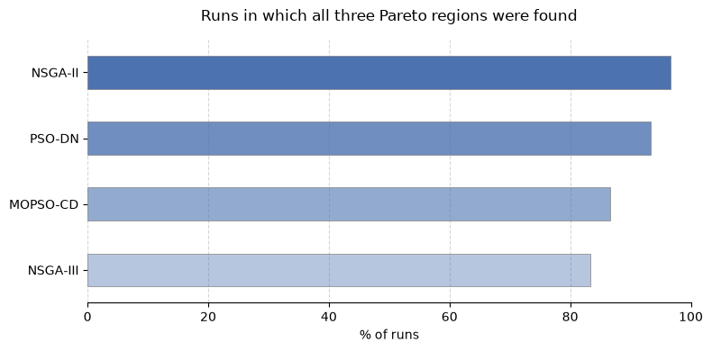

# PSO-DN for Multimodal Multi-Objective Location Optimization

This repository contains a Python implementation and experimental analysis of **PSO-DN**: a Particle Swarm Optimization algorithm with Dynamic Strategy for multimodal multi-objective optimization problems.

The project focuses on a map-based location optimization benchmark, where the goal is to find locations that optimize multiple conflicting distance-based objectives. The problem is multimodal because several disconnected Pareto-optimal regions in the decision space can correspond to equivalent or similar Pareto-optimal trade-offs in the objective space.

The implementation is inspired by the paper:

> [A Particle Swarm Optimization with Dynamic Strategy for Multi-modal Multi-objective Location Optimization Problem](https://ieeexplore.ieee.org/document/10294853)

In addition to implementing PSO-DN, the repository compares its behaviour against other multi-objective algorithms, including MOPSO-CD, NSGA-II, and NSGA-III.

---

## Project goals

The main goals of this project are:

* implement PSO-DN for a multimodal multi-objective location problem;
* reproduce the qualitative behaviour described in the reference paper;
* tune the main hyperparameter of PSO-DN, the initial neighborhood radius;
* compare PSO-DN with other multi-objective algorithms;
* evaluate both objective space quality and decision space Pareto sets (PSs) recovery;
* study whether PSO-DN is effective at discovering multiple disconnected PSs.

---

## Problem description

The benchmark is a two-dimensional location optimization problem defined on a map-like search space[^1]. A candidate solution is a point $x = (x_1, x_2)$ in the decision space. The objectives are distance-based functions measuring proximity to different classes of facilities, such as elementary schools, high-schools, convenience stores, and railway stations.

The problem is multi-objective because the objectives are conflicting: improving distance to one type of facility can worsen distance to another. It is also multimodal because the PS is not connected: several disjoint regions in the decision space may correspond to Pareto-optimal solutions.

Infrastructure constraints are also considered: solutions lying on roads and railways are removed from the final feasible approximation sets.

The pareto sets are shown in the following image.

<p align="center">  </p>

---

## PSO-DN algorithm

PSO-DN is a particle swarm optimization method designed to improve diversity maintenance in multimodal multi-objective problems.

The main idea is to avoid driving the entire swarm toward a single global leader. Instead, the population is divided into local sub-populations using a dynamic neighborhood radius. Each particle is then guided by both:

1. a personal-best solution selected from its own personal archive;
2. a neighborhood-best solution selected from the local sub-population.

The update rule has the usual PSO structure:

$$
v_i(t) = w v_i(t-1) + c_1 r_1 (pbest_i(t) - x_i(t)) + c_2 r_2 (nbest_i(t) - x_i(t)),
$$

$$
x_i(t) = x_i(t-1) + v_i(t).
$$

Here:

* $x_i(t)$ is the position of particle $i$;
* $v_i(t)$ is its velocity;
* $pbest_i(t)$ is a selected personal-best solution;
* $nbest_i(t)$ is the best solution in the particle's current subpopulation;
* $w$, $c_1$ and $c_2$ are the inertia and learning coefficients.

Diversity is promoted using the **Special Crowding Distance (SCD)**, which combines crowding information in both the decision space and the objective space. In this implementation, SCD is used to select representative solutions from the archives and neighborhoods.

The original paper does not fully specify some implementation details, in particular how exactly the dynamic radius is used to construct sub-populations and how boundary handling is performed. Therefore, this repository implements a practical niching-based interpretation of the dynamic neighborhood mechanism.

---

## Compared algorithms

The comparative analysis includes:

* **PSO-DN**: the implemented dynamic-neighborhood particle swarm method;
* **MOPSO-CD**: a multi-objective PSO variant based on crowding-distance archive selection;
* **NSGA-II**: a classical genetic multi-objective algorithm based on non-dominated sorting and crowding distance;
* **NSGA-III**: a reference-direction-based genetic algorithm for many-objective optimization.

The comparison is performed over multiple independent runs.

---

## Evaluation metrics

The algorithms are evaluated using both objective-space and decision-space indicators.

### Objective-space metrics

* **Hypervolume (HV)**  
  Measures the dominated volume in objective space with respect to a reference point[^2]. Higher values are better.

  The experiments use:

  * $HV_{200}$, with reference point $(200, 200, 200, 200)$;
  * $HV_{400}$, with reference point $(400, 400, 400, 400)$;
  * $HV_{dyn}$, with a dynamic reference point computed from the observed objective values.

### Decision-space metrics

* **IGDX**  
  Measures the average distance between the obtained solution set $A_X$ and the true PS, represented by a finite set of Pareto optimal solutions $R_X$ uniformly sampled from it:

  $$
  IGDX(A_X, R_X) = \frac{1}{|R_X|} \sum_{x \in R_X} \min_{a \in A_X} |x-a|.
  $$

  Lower values are better.

* **Balanced IGDX**  
  Computes IGDX separately for each known Pareto-set region and then averages the values; in the benchmark problem, there are three PSs:

  $$
  IGDX_{bal} = \frac{1}{3} \sum_{i=1}^{3} IGDX_i.
  $$

  This prevents the largest PS from dominating the global IGDX value.

* **Number of regions found**  
  Counts how many of the known PSs are discovered by the algorithm.

* **All-regions-found percentage**  
  Percentage of runs in which all three PSs are discovered.

* **Balanced coverage@$\varepsilon$**
  Measures the fraction of reference PS points covered within a distance threshold $\varepsilon$, computed set-wise and then averaged across the three sets.

  In the reported results, $\varepsilon = 0.05$, matching the reference grid resolution.

---

## Results

The following table summarizes the main metrics computed over independent runs.

For HV, higher values are better. For IGDX and balanced IGDX, lower values are better. For region discovery and coverage, higher values are better.

| Algorithm |  Mean HV200 |  Mean HV400 |  Mean HVdyn | Mean IGDX | Balanced IGDX | All regions found (%) | Balanced coverage@0.05 | Mean Sols |
| :-------- | ----------: | ----------: | ----------: | --------: | ------------: | --------------------: | ---------------------: | --------: |
| PSO-DN    | 1.55703e+09 | 2.53571e+10 |  3.7691e+06 |     0.762 |         0.832 |                93.333 |                  0.023 |   724.267 |
| MOPSO-CD  | 1.55656e+09 | 2.53458e+10 | 3.83107e+06 |     0.551 |          1.45 |                86.667 |                  0.027 |   **2710.53** |
| NSGA-II   | **1.56414e+09** | **2.54059e+10** | **3.89862e+06** |     0.357 |         **0.598** |                **96.667** |                  **0.049** |   1525.23 |
| NSGA-III  | 1.56346e+09 | 2.53993e+10 | 3.89779e+06 |     **0.251** |         1.523 |                83.333 |                   0.04 |    2178.4 |

The complete metrics table is available in:

```text
results/metrics_summary.csv
```

### Main observations

The HV values show that NSGA-II and NSGA-III obtain the strongest objective space performance, with NSGA-II achieving the highest mean values across the HV indicators. This suggests that the genetic algorithms produce better Pareto-front approximations in objective space.

The global IGDX favours NSGA-III, while PSO-DN obtains the worst value among the compared algorithms. However, global IGDX is strongly influenced by the largest Pareto set, because most reference points belong to that region. 

<p align="center"> </p>


For this reason, balanced IGDX provides a complementary view: it computes IGDX separately on each Pareto set and then gives the same weight to each region. Under this metric, NSGA-II remains the best algorithm, but PSO-DN emerges as the second-best method, significantly outperforming MOPSO-CD. This suggests that PSO-DN is highly competitive when all Pareto sets are prioratized equally, rather than by sheer volume.

<p align="center"> </p>

The region-discovery metrics are particularly relevant for PSO-DN. It discovers all three PSs in 93.33% of the runs, which is close to NSGA-II and higher than both MOPSO-CD and NSGA-III. 

A closer look at the region-wise IGDX reveals distinctly different algorithmic behaviors. The GAs excel at localized refinement once a region is found. In contrast, PSO-DN exhibits robust multimodal stability, achieving uniform IGDX scores across all three regions. Without the dynamic radius strategy, MOPSO-CD severely struggles to cover the smallest region $R1$. Thus, PSO-DN reliably reaches all disconnected fronts, whereas MOPSO-CD tends to drop harder-to-reach sets and the GAs tend to prioritize dense exploitation of specific areas.

<div style="display: grid; grid-template-columns: 1fr 1fr; gap: 20px;">
  <div>
    
  </div>
  <div>
    
  </div>
</div> 


Overall, the results suggest that PSO-DN is effective at locating multiple disconnected PSs, whereas the GAs excel at dense, accurate local coverage. Still the current implementation does not dominate the genetic algorithms in terms of HV or fine-grained decision space coverage.

---

## Repository Structure

```text
.
├── data/
│   └── test_map.py                 # map data: facilities, infrastructure, bounds, and plotting styles
├── notebook/
│   ├── pso-dn-for-mmop.ipynb       # interactive notebook explaining and running PSO-DN
│   └── comparative_analysis.ipynb  # experimental notebook for tuning, comparison and analysis
├── results/
│   ├── comparison_main.json        # cached per-run comparison results
│   ├── tuning_results.json         # cached tuning results
│   ├── metrics_summary.csv         # complete summary table with all global and region-wise metrics
│   └── readme_metrics_summary.md   # compact table with main results
├── src/
│   ├── optimizers/
│   │   ├── base_optimizers.py      # shared optimizer structure and PSO utilities
│   │   ├── mopso_cd.py             # MOPSO-CD implementation
│   │   └── pso_dn.py               # PSO-DN implementation
│   ├── archives.py                 # dataclasses for handling dominance-based solution archives (PBA & GBA)
│   ├── mo_utils.py                 # multi-objective utilities: dominance, sorting, crowding distance, SCD, IGDX
│   ├── plot_utils.py               # plotting functions for the map and solution sets
│   └── problem.py                  # LocationProblem class and objective evaluation logic
├── generate_true_pareto.py         # generates the dense reference Pareto set used for IGDX and coverage
├── main.py                         # simple entry point for running the optimization from the terminal
├── README.md                       # you're here!
└── requirements.txt                # python dependencies

```

---

## Installation

Clone the repository:

```bash
git clone https://github.com/silviacalabretta/pso-dn-mmop.git
cd pso-dn-mmop
```

Create and activate a virtual environment:

```bash
python -m venv .venv
```

On Windows:

```bash
.venv\Scripts\activate
```

On Linux/macOS:

```bash
source .venv/bin/activate
```

Install the dependencies:

```bash
pip install -r requirements.txt
```

---

## Usage

### Run the basic PSO-DN script

From the root of the repository:

```bash
python main.py
```

This initializes the location problem, runs the optimizer, and displays the discovered non-dominated solutions on the map.

### Generate the reference Pareto set

The dense reference Pareto set used for IGDX and coverage can be generated with:

```bash
python generate_true_pareto.py --step 0.05
```

This creates a file such as:

```text
data/true_pareto_step0.05.npz
```

containing:

```python
X_true  # reference Pareto set in decision space
F_true  # reference Pareto front in objective space
```

### Run the comparative analysis

Open:

```text
notebooks/comparative_analysis.ipynb
```

This notebook performs the main experimental comparison. It includes:

* algorithm tuning;
* repeated independent runs;
* HV computation;
* IGDX computation;
* region-wise metrics;
* balanced IGDX;
* coverage metrics;
* result caching;
* final summary tables and plots.

The notebook uses cached results from `results/` when available, so the full experiment does not need to be recomputed every time.

### Inspect the PSO-DN algorithm interactively

Open:

```text
notebooks/pso-dn-algorithm.ipynb
```

This notebook is useful for understanding the PSO-DN implementation and visualizing how the algorithm behaves on the location problem.

---

## Notes on reproducibility

Some implementation choices are not fully specified in the reference paper, especially the exact procedure used to divide the population into sub-populations using the dynamic radius and the boundary-management strategy after particle updates.

For this reason, the repository should be interpreted as a practical implementation and experimental study of PSO-DN rather than an exact line-by-line reproduction of the original authors' code.

The additional metrics used here, especially IGDX, balanced IGDX, and region-wise coverage, provide a stricter decision-space evaluation than the original paper, which mainly relies on the number of obtained Pareto-optimal solutions and HV.

## References
Y. Sun, J. Shen, X. Zhang and C. Sun, "A Particle Swarm Optimization with Dynamic Strategy for Multi-Modal Multi-Objective Location Optimization Problem," 2023 5th International Conference on Data-driven Optimization of Complex Systems (DOCS), Tianjin, China, 2023, pp. 1-6, doi: 10.1109/DOCS60977.2023.10294853. 

[^1] Ishibuchi, Hisao & Akedo, Naoya & Nojima, Yusuke. (2011). A many-objective test problem for visually examining diversity maintenance behavior in a decision space. Genetic and Evolutionary Computation Conference, GECCO'11. 649-656. 10.1145/2001576.2001666.   

[^2] Andreia P. Guerreiro, Carlos M. Fonseca, and Luís Paquete. 2021. The Hypervolume Indicator: Computational Problems and Algorithms. ACM Comput. Surv. 54, 6, Article 119 (July 2022), 42 pages. https://doi.org/10.1145/3453474  